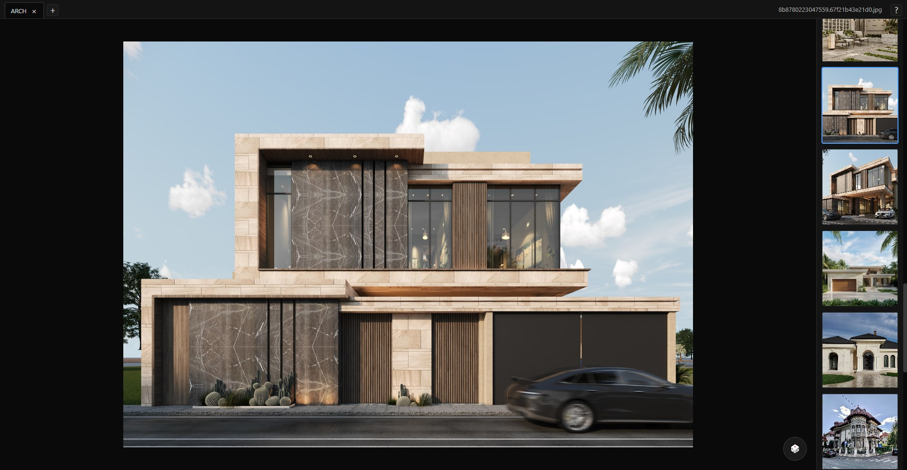

# Modern Gallery Viewer

A simple, modern, and elegant gallery viewer for your local images and videos.
## 🔗 Check out [Gallery Pro](https://far-se.github.io/gallery-pro)

## Features

*   **Local First:** Access your media directly from your computer. No uploads, no cloud, no tracking.
*   **Multi-gallery Support:** Organize your media into multiple galleries.
*   **Image and Video Support:** View your favorite images and videos.
*   **Modern UI:** A clean and intuitive user interface.
*   **Keyboard and Mouse Controls:** Navigate through your media with ease.
*   **Random Mode:** Shuffle through your media.

## How to Use

1.  Clone this repository or download the files.
2.  Open the `index.html` file in your browser.
3.  Click the `+` button to create a new gallery.
4.  Select a folder containing your images and videos.
5.  Enjoy your media!

## Controls

### Mouse

*   **Left Click:** Drag to pan the image.
*   **Right Click + Drag:** Zoom in/out (image) or seek (video).
*   **Mouse Wheel:** Navigate between images/videos.

### Keyboard

*   **Arrow Left/Right:** Navigate between images/videos.
*   **R:** Toggle random mode.
*   **Spacebar:** Play/pause video.

## Future Improvements

*   Add support for more file formats.
*   Add a search functionality.
*   Add a settings panel to customize the viewer.
*   Improve performance for large galleries.
